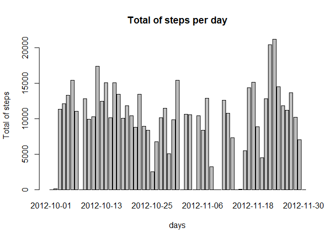
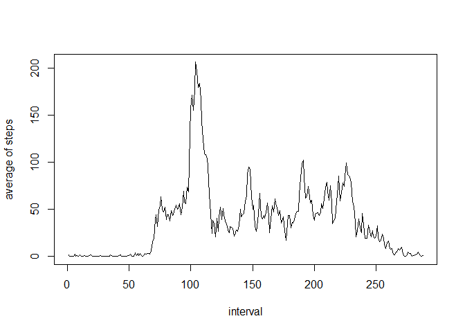
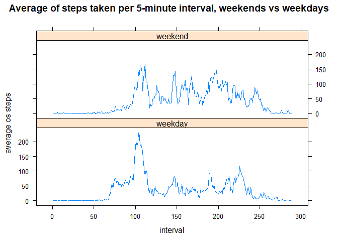

## Loading and preprocessing the data
First, we unzip the data that is stored in the "activity.zip" file and load it to R.


```r
unzip("activity.zip")
activity <- read.csv("activity.csv", header = TRUE)
```
And we check if it is necesary to process the data. First we check summary and structure of the data:


```r
summary(activity)
```

```
##      steps            date              interval     
##  Min.   :  0.00   Length:17568       Min.   :   0.0  
##  1st Qu.:  0.00   Class :character   1st Qu.: 588.8  
##  Median :  0.00   Mode  :character   Median :1177.5  
##  Mean   : 37.38                      Mean   :1177.5  
##  3rd Qu.: 12.00                      3rd Qu.:1766.2  
##  Max.   :806.00                      Max.   :2355.0  
##  NA's   :2304
```

```r
str(activity)
```

```
## 'data.frame':	17568 obs. of  3 variables:
##  $ steps   : int  NA NA NA NA NA NA NA NA NA NA ...
##  $ date    : chr  "2012-10-01" "2012-10-01" "2012-10-01" "2012-10-01" ...
##  $ interval: int  0 5 10 15 20 25 30 35 40 45 ...
```
We make interval column into a factor so we can use it later to make the plots


```r
activity$interval <- as.factor(activity$interval)
```

And convert the date column into a date format


```r
activity$date <- as.Date(activity$date, format = "%Y-%m-%d")
```
## What is mean total number of steps taken per day?

To answer this question, we first compute the total steps taken per day


```r
stepsxd <- sapply(split(activity, activity$date), function(x){ sum(x[,1], na.rm = TRUE)})
```
We make a data frame so we can plot it


```r
df <- data.frame(stepsxd, days = unique(as.character(activity$date)))
```

and we make a histogram with this data 


```r
barplot(stepsxd~days, data=df, ylab = "Total of steps", main="Total of steps per day")
```

<!-- -->

And now we compute the mean and median of steps per weekday


```r
df$days <- as.Date(df$days, format = "%Y-%m-%d")
meansteps <- sapply(split(df, weekdays(df$days)), function(x){mean(x[,1])})
mediansteps <- sapply(split(df, weekdays(df$days)), function(x){median(x[,1])})
meanddf1 <- data.frame(mean=meansteps, median=mediansteps)
print(meanddf1)
```

```
##                mean  median
## Friday     9613.111 10600.0
## Monday     7758.222 10139.0
## Saturday  10968.500 11498.5
## Sunday    10743.000 11646.0
## Thursday   7300.222  7047.0
## Tuesday    8949.556  8918.0
## Wednesday 10480.667 11352.0
```


## What is the average daily activity pattern?

First we compute the average of steps taken acrooss the 5 minute intervals


```r
avgsteps <- sapply(split(activity, activity$interval), function(x){mean(x[,1], na.rm = TRUE)})
df2 <- data.frame(interval=1:288, avgsteps)
```
and then we make the time series plot


```r
plot(df2, ylab="average of steps", type="l")
```

<!-- -->

```r
activity$interval[100]
```

```
## [1] 815
## 288 Levels: 0 5 10 15 20 25 30 35 40 45 50 55 100 105 110 115 120 125 ... 2355
```

In this plot we can see that the 5-minute interval in which more steps are taken is around the interval 100, that is in the interval between 8:15 and 8:20.


## Imputing missing values

The missing values in the data sets are:

```r
sum(is.na(activity$steps))
```

```
## [1] 2304
```
We can see that there are several days with no count of steps, and we notice this since very day must contain 288 observations.


```r
sapply(split(activity, activity$date), function(x){sum(is.na(x[,1]))})
```

```
## 2012-10-01 2012-10-02 2012-10-03 2012-10-04 2012-10-05 2012-10-06 2012-10-07 
##        288          0          0          0          0          0          0 
## 2012-10-08 2012-10-09 2012-10-10 2012-10-11 2012-10-12 2012-10-13 2012-10-14 
##        288          0          0          0          0          0          0 
## 2012-10-15 2012-10-16 2012-10-17 2012-10-18 2012-10-19 2012-10-20 2012-10-21 
##          0          0          0          0          0          0          0 
## 2012-10-22 2012-10-23 2012-10-24 2012-10-25 2012-10-26 2012-10-27 2012-10-28 
##          0          0          0          0          0          0          0 
## 2012-10-29 2012-10-30 2012-10-31 2012-11-01 2012-11-02 2012-11-03 2012-11-04 
##          0          0          0        288          0          0        288 
## 2012-11-05 2012-11-06 2012-11-07 2012-11-08 2012-11-09 2012-11-10 2012-11-11 
##          0          0          0          0        288        288          0 
## 2012-11-12 2012-11-13 2012-11-14 2012-11-15 2012-11-16 2012-11-17 2012-11-18 
##          0          0        288          0          0          0          0 
## 2012-11-19 2012-11-20 2012-11-21 2012-11-22 2012-11-23 2012-11-24 2012-11-25 
##          0          0          0          0          0          0          0 
## 2012-11-26 2012-11-27 2012-11-28 2012-11-29 2012-11-30 
##          0          0          0          0        288
```

In order to fill in the missing values, we first duplicate the data frame and we replace the mssing values with -1's and we find the indices where the activity dataset has missing values.


```r
activity_duplicate <- activity
activity_duplicate[is.na(activity)] <- -1
na <- is.na(activity$steps)
```

Next, we make into 0 the indices where activity has no missing values


```r
activity_duplicate$steps[!na] <- 0
```

Now, we introduce the averaged steps per 5-minute interval in the new dataset.


```r
activity_duplicate$steps2 <- activity_duplicate$steps*avgsteps
activity_duplicate$steps2 <- (-1)*activity_duplicate$steps2
activity_duplicate$steps <- activity$steps
activity_duplicate$steps[na] <- 0
```

Next, we add original data and new data


```r
activity_duplicate$steps2 <- activity_duplicate$steps+activity_duplicate$steps2
```

And finally we obtain our new dataset, that has no missing values


```r
activity_2 <- data.frame(steps=activity_duplicate$steps2, activity[,2:3])
sum(is.na(activity_2$steps))
```

```
## [1] 0
```

Now, we repeat the process to make a new plot:


```r
stepsxd <- sapply(split(activity_2, activity$date), function(x){ sum(x[,1])})
df3 <- data.frame(stepsxd, days = unique(as.character(activity_2$date)))
barplot(stepsxd~days, data=df3, ylab = "Total of steps", main="Total of steps per day")
```

<!-- -->

To calculate and report mean and median of the new data, we repeat the previous process


```r
df3$days <- as.Date(df3$days, format = "%Y-%m-%d")
meansteps <- sapply(split(df3, weekdays(df3$days)), function(x){mean(x[,1])})
mediansteps <- sapply(split(df3, weekdays(df3$days)), function(x){median(x[,1])})
meanddf2 <- data.frame(mean=meansteps, median=mediansteps)
print(meanddf2)
```

```
##                mean   median
## Friday    12005.597 10766.19
## Monday    10150.709 10765.00
## Saturday  12314.274 11596.09
## Sunday    12088.774 11646.00
## Thursday   8496.465 10056.00
## Tuesday    8949.556  8918.00
## Wednesday 11676.910 11352.00
```

And finally, we check tje difference in the means and medians with the missing values filled in:


```r
abs(meanddf1-meanddf2)
```

```
##               mean     median
## Friday    2392.486  166.18868
## Monday    2392.486  626.00000
## Saturday  1345.774   97.59434
## Sunday    1345.774    0.00000
## Thursday  1196.243 3009.00000
## Tuesday      0.000    0.00000
## Wednesday 1196.243    0.00000
```


## Are there differences in activity patterns between weekdays and weekends?

First, we create the factor variable wih the levels "weekday" and "weekend"


```r
wkend <- c("Saturday", "Sunday")
wkd <- function(x){
            if(weekdays(x) %in% wkend){
                        w <- "Weekend"}
            else{
                        w <- "Weekday"
            }
            w
}

wkdays <- lapply(activity_2$date, wkd)
wkdays <- as.factor(unlist(wkdays))

activity_2$weekday <- wkdays
```

And now we make a plot to find the difference in the average of steps taken per day during weekdays and weekends.


```r
wknds <- subset(activity_2, weekday=="Weekend")
wkdys <- subset(activity_2, weekday=="Weekday")
avgsteps <- sapply(split(wknds, wknds$interval), function(x){mean(x[,1], na.rm = TRUE)})
dfwknd <- data.frame(interval=1:288, avgsteps)
avgsteps <- sapply(split(wkdys, wkdys$interval), function(x){mean(x[,1], na.rm = TRUE)})
dfwkdy <- data.frame(interval=1:288, avgsteps)
fact <- c(rep("weekday", 288), rep("weekend", 288))
fact <- as.factor(fact)
df4 <- rbind(dfwkdy, dfwknd)
df4$weekday <- fact

library(lattice)
xyplot(avgsteps~interval|weekday, data = df4, type="l", layout=c(1,2), ylab = "average os steps",
       main="Average of steps taken per 5-minute interval, weekends vs weekdays")
```

<!-- -->


